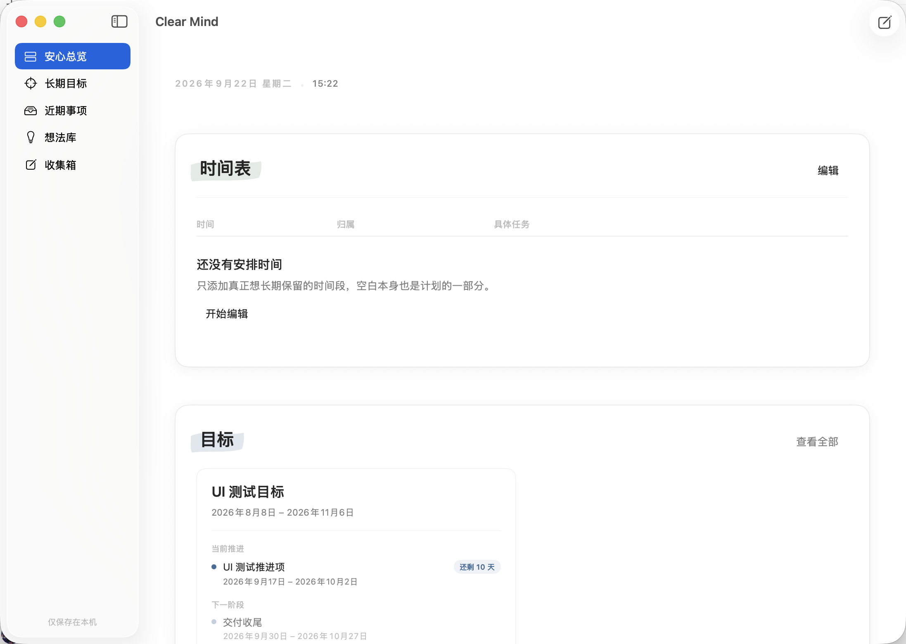
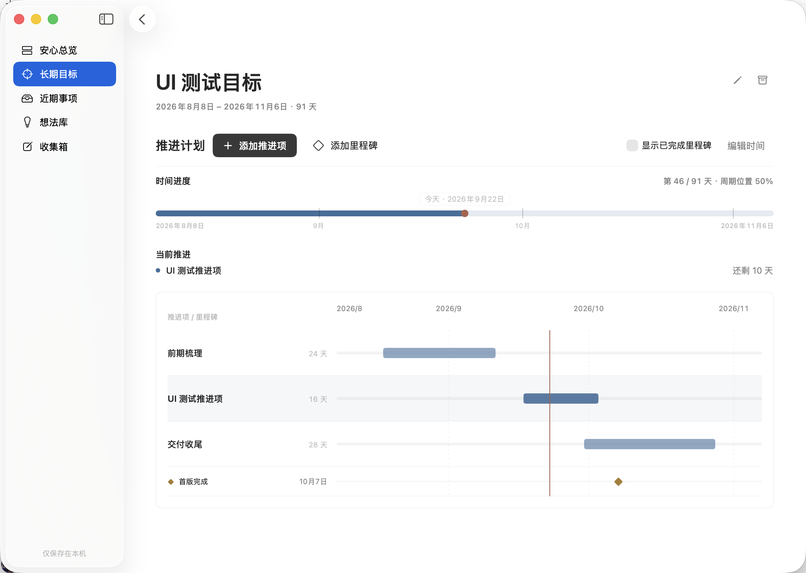
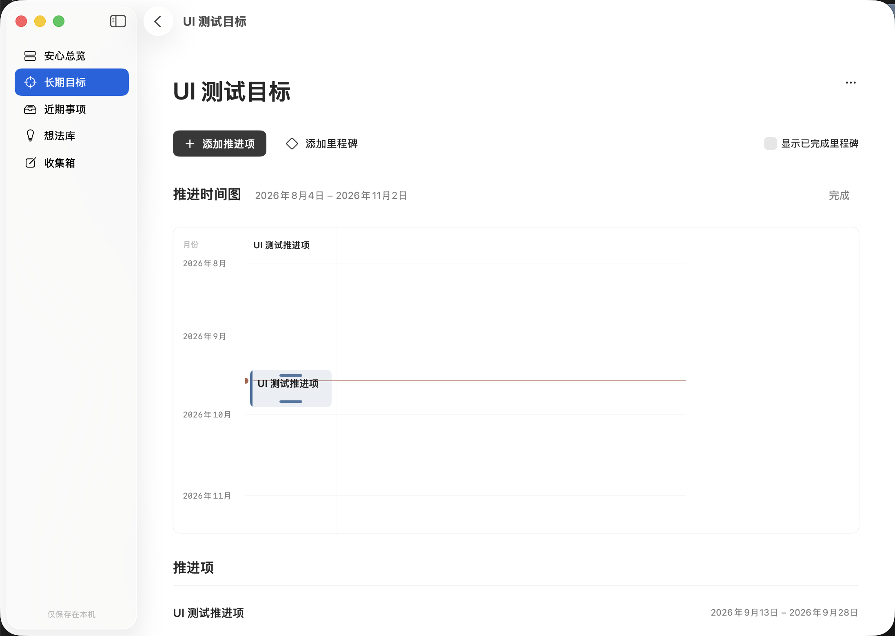
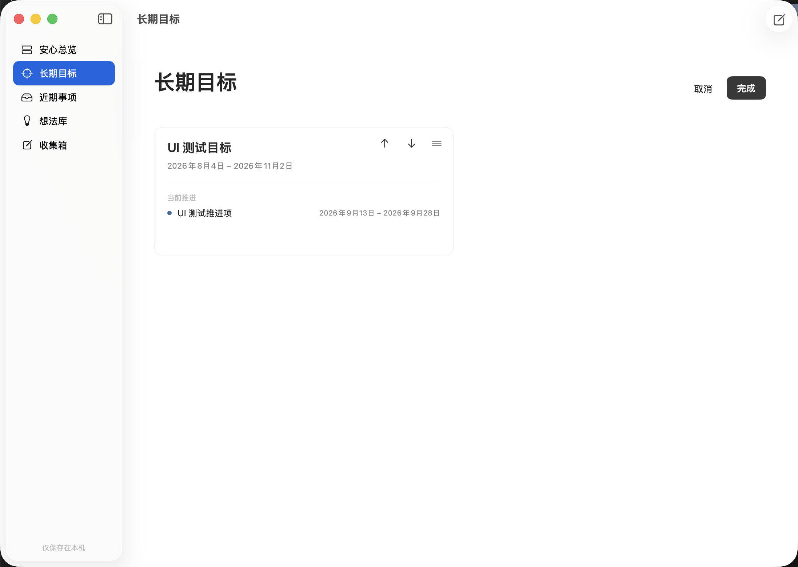

# Clear Mind

Clear Mind 是一个本地优先的原生 macOS 应用，用来托管长期目标、近期事项和暂时无法处理的想法。它不包含账号、云同步、遥测，也不尝试替代每日 Todo。安心总览将当天日期与当前时间收拢为一组信息，下方的“时间表”呈现一天的安排。



## 界面预览

### 目标规划总览

长期目标默认显示横向规划图：整个目标周期适配页面宽度，每个推进项以名称和持续天数占一行，可直观看到持续时间与并行关系。“时间进度”只表示日期位置，不代表完成情况；悬停后会展开目标起止日期、自然月份分界和今日位置。推进项本身悬停时只显示精确起止日期，点击推进条或里程碑可打开表单。



进入“编辑时间”后，切换到详细时间图，可以通过推进条两端的把手调整开始日和结束日；点击推进条仍可进行精确编辑。



### 手动排列长期目标

长期目标的展示顺序由用户决定，不会因为最近访问或编辑而自动变化。排序模式支持拖放，也提供前移、后移、取消和一次性保存。



> 截图使用内存演示数据生成，不包含真实用户数据。

## 核心功能

- 单一的一天时间表，支持整表编辑、时间冲突校验、自由归属和持久清单
- 可手动排序的长期目标、并行推进项、里程碑、横向规划总览和纵向时间编辑图
- 安心总览通过当前推进、下一阶段、日期范围、剩余天数和本月月历呈现今天所处的位置
- 简洁的近期事项托管，不依赖截止或回看日期
- 想法库、低频收集箱、标签和全局搜索
- SwiftData 本地存储和完整 JSON 备份导入／导出

## 使用示例

假设你正在推进一个持续三个月的目标：

1. 在“长期目标”中新建目标，填写目标周期和说明。
2. 添加一个或多个推进项，例如“需求梳理”和“第一版实现”，分别设置起止日期。
3. 回到“安心总览”，通过“当前推进”与月历确认今天位于哪个推进阶段，以及距离结束还有多少天。
4. 在目标详情的横向规划图中查看各推进项占用的时间；计划变化时点击“编辑时间”，拖动详细图中的推进条把手调整日期，或点击推进条打开编辑表单。
5. 在长期目标页进入“排序”，把当前最重要的目标移动到前面，然后点击“完成”保存顺序。
6. 需要迁移或留存数据时，在“Clear Mind → 设置”中导出 `.clearmindbackup` 备份。

## 运行

1. 使用 Xcode 26 或兼容版本打开 `ClearMind.xcodeproj`。
2. 选择 `ClearMind` scheme 和 `My Mac`。
3. 按 `⌘R` 运行。

最低部署版本为 macOS 15。项目没有第三方依赖。

## 验证

```sh
xcodebuild -project ClearMind.xcodeproj \
  -scheme ClearMind \
  -destination 'platform=macOS' \
  -derivedDataPath /tmp/clearmind-derived \
  CODE_SIGNING_ALLOWED=NO test
```

UI 冒烟测试位于 `ClearMindUI` scheme。首次运行需要允许 Xcode 使用 macOS UI 自动化：

```sh
xcodebuild -project ClearMind.xcodeproj \
  -scheme ClearMindUI \
  -destination 'platform=macOS' \
  -derivedDataPath /tmp/clearmind-ui-derived \
  test
```

日常数据保存在应用的 Application Support 容器中。通过“Clear Mind → 设置”可以导出或导入 `.clearmindbackup` 文件。
